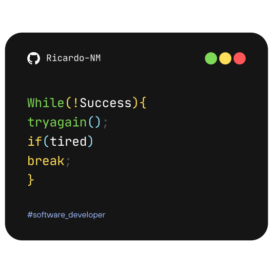

My name is Ricardo Nava Mayoral, I'm a **Full Stack Developer** with a background in Computer Science, focused on building modern web applications and practical software solutions.

 

- **Specialist** in the development of enterprise systems, administrative platforms, and web applications.
- Proficiency in development tools and technologies to **solve technical problems** and create functional, scalable, and well-structured solutions.
- Involvement in the entire **development lifecycle**, from analysis and design to deployment, continuous improvement, and system optimization.

 

- [**KUENTAS:**](https://github.com/Ricardo-NM/KUENTAS) Web application currently under development for managing personal financial information via a private dashboard. It features custom authentication, secure sessions, password recovery, multilingual support, and initial views for payments, a calendar, statistics, and settings.
- [**Gestión operativa – Comercio exterior:**](https://ricardo-nm.github.io/K-PUGA-Docs/) A private system designed to centralize operational, administrative, and document-related processes concerning logistics management, reference tracking, document control, invoicing, reporting, internal communication, and human resources activities.
- [**Totis® | Gestión de bienes:**](https://ricardo-nm.github.io/totis-gdb-docs/) A web-based system designed for the operational management and control of accounting fixed assets. Its purpose is to centralize information, facilitate internal requests, maintain movement traceability, and support the generation of documents related to assignments, write-offs, returns, and transfers.

 

My experience spans frontend, backend, databases, and infrastructure, enabling me to design, develop, and deploy complete, **scalable solutions** aligned with business needs. 

**FRONTEND** 

**BACKEND** 

**DATABASES** 

**DEVELOPMENT TOOLS** 

 

Visit my [**porfolio website**](https://rnm.com.mx/) for complete background and contact.

  
  

